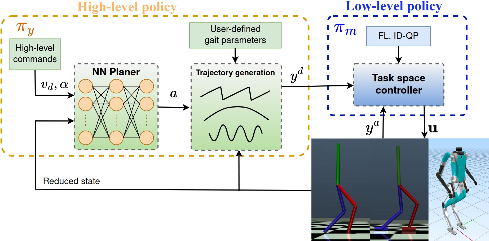

**Big congratulations to [Guillermo]()!**
<!--more-->

Our paper titled, ["Effective State Representation for Learning Hierarchical Robust Bipedal Locomotion"](https://drive.google.com/file/d/1uIIhuSM63VB7sdclcYhOMAHSnD7ZEGo8/view), won the Best Paper Award at the 2023 ICRA Workshop on Effective Representations, Abstractions, and Priors for Robot Learning [(RAP4Robots)](https://sites.google.com/view/rap4robots), held in London, UK. 

We greatly appreciate the acknowledgement to our work from the workshop programming committee.

## Abstract

This paper introduces an innovative hierarchical strategy for bipedal walking that merges a data-driven effective state representation of the system with a Reinforcement Learning (RL)-based high-level (HL) policy for real-time generation of task space commands and a model-based low-level (LL) controller for task space trajectory tracking. Distinct from conventional end-to-end learning techniques, our HL policy leverages insights from reduced-order template models to thoughtfully design the observation and action spaces of the Markov Decision Process (MDP). This efficient design establishes a meaningful connection between a low-dimensional latent state that effectively encapsulates the intricate dynamics of bipedal walking and a collection of task space outputs that shape the robot’s walking gait. The HL policy remains independent of the task space LL controller, enhancing the design’s flexibility and adaptability to other bipedal robots. This hierarchical design shows superior performance and robustness compared to a traditional template model-inspired learning-based approach for bipedal walking. The trained policy inherently learns human-like locomotion behaviors and effectively tracks an extensive range of walking speeds while maintaining the walking gait’s robustness and stability, even in challenging conditions.

